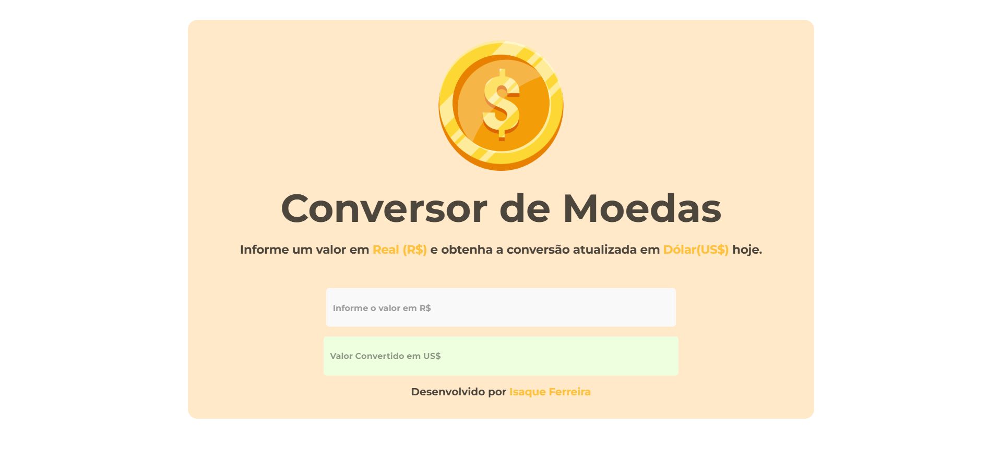

# 🪙 Conversor de Moedas (ChooseCoin) - Em produção

## 📌 Sobre

Este projeto consiste em um sistema web de conversão de moedas a partir de uma moeda de origem. 

Seu MVP consiste inicialmente na conversão de Real (R$) para Dólar (US$). 

Porém o objetivo é possibilitar a conversão de qualquer moeda e criptomoeda no mundo.

## 📌 Ferramentas

O sistema utiliza a API [FXRatesAPI.com](https://fxratesapi.com/docs) para obter os dados das cotações em tempo real.

  

  

